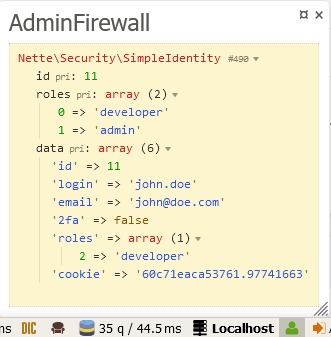

Installation
----

The best way to install Contributte/Firewall is using [Composer](http://getcomposer.org/):

```sh
composer require contributte/firewall
```

Configuration
----

```php
<?php
declare(strict_types=1);

namespace App\Security;

class AdminFirewall extends \Contributte\Firewall\Authentication\BaseFirewall{

	public function authenticate(string $login, string $password):void{
            // check credentials
            $this->login(new \Nette\Security\SimpleIdentity('User ID'));    	
	}
}
```

```neon
extensions: 
	firewall: Contributte\Firewall\DI\FirewallExtension
	
firewall:
	namespaces:
		admin: App\Security\AdminFirewall
		web: App\Security\WebFirewall 
```

With this basic configuration all Firewalls are using `Contributte\Firewall\Bridges\SessionStorage`.
This storage is just bridge for `\Nette\Bridges\SecurityHttp\SessionStorage`.

You can create your own storage, but it must implement `Contributte\Firewall\Authentication\UserStorage`.
Then you can use it as default storage for all firewalls or just for one. 

```neon
firewall:
	namespaces:
		storage: App\Security\CustomSecurityStorage # change of default storage
		admin: 
			firewall: App\Security\AdminFirewall
			storage: App\Security\CustomAdminStorage # change storage for this firewall
		web:
			firewall: App\Security\WebFirewall
			validator: App\Security\IdentityValidator
			authorizator: App\Security\Authorizator 
```

Firewalls can use Identity Validators to update data in Identity.

You can achieve same funcionality if storage implements `\Nette\Security\IdentityHandler`.
Then firewall will use `sleepIdentity` and `wakeupIdentiy` functions instead of IdentityValidator.

Tracy Panel
----
Library include own Tracy panel to show information about currently used Firewall and stored identity.



To disable default Tracy panel for Nette/Security add this lines to `config.neon`
```neon
security:
	debugger: false
```
